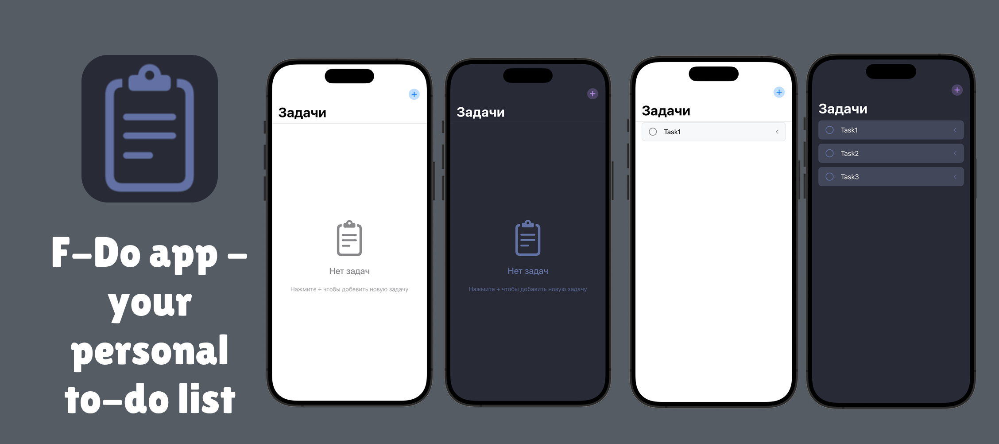

# F-doAPP
[EN README](README.md) | [RU README](READMERU.md)

  



## What is it?

A simple iOS app for making to-do lists. 

## ✨ Opportunities

- Adaptive Dracula theme (light/dark)
- 📝 Adding, editing, and deleting tasks
- ✅ Marking completed tasks
- 💾 Auto-save data using `@AppStorage`
- 🧹 Swipe to delete tasks
- 🚀 Smooth interface animations
- 📱 Fully native SwiftUI app

## 🛠 Technologies

- **Swift** - programming language
- **SwiftUI** -  UI framework
- **@AppStorage** - data storage
- **Combine** - reactive programming
- **Codable** - data serialization
- **DragGesture** - swipe gestures

## 🎨 Color theme

The application uses the Dracula palette:

| Color | HEX | Usage |
|------------|----------|---------------------------|
| Background | #282a36 | Main background |
| Current    | #44475a  | Secondary background |
| Foreground | #f8f8f2 | Main text |
| Comment | #6272a4 | Secondary text |
| Purple | #bd93f9 | Accent elements |
| Green | #50fa7b | Completed tasks |
| Red | #ff5555 | Delete button |

## Installation

1. Clone the repository:
```bash
git clone https://github.com/yourusername/dracula-todo.git](https://github.com/ArduRadioKot/F-doAPP.git
```

2. Open the project in Xcode 15+

3. Run on the simulator or device (iOS 17+)

## 🚀 What's next?

- [x] Adding chips (calendar, etc.)
- [x] Adding note functionality
- [x] Sorting issues
- [ ] Widget for the home screen
- [ ] iCloud sync
- [ ] Widgets for Apple Watch
- [ ] Creating a fully-fledged productivity tracking app

## 📝 License

**GPL-2.0** [LICENSE](LICENSE)
