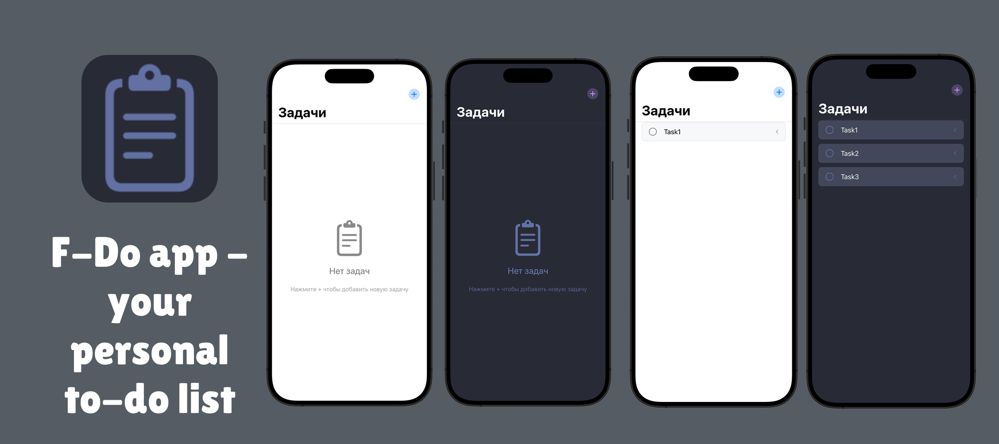

# F-doAPP

  



## Что это?

Простое приложение для IOS чтобы составлять to-do листы

## ✨ Возможности

- 🎨 Адаптивная Dracula-тема (светлая/тёмная)
- 📝 Добавление, редактирование и удаление задач
- ✅ Отметка выполненных задач
- 💾 Автосохранение данных с помощью `@AppStorage`
- 🧹 Свайп для удаления задач
- 🚀 Плавные анимации интерфейса
- 📱 Полностью нативное SwiftUI приложение

## 🛠 Технологии

- **Swift** - язык программирования
- **SwiftUI** - UI-фреймворк
- **@AppStorage** - хранение данных
- **Combine** - реактивное программирование
- **Codable** - сериализация данных
- **DragGesture** - жесты для свайпа

## 🎨 Цветовая тема

Приложение использует палитру Dracula:

| Цвет       | HEX      | Использование             |
|------------|----------|---------------------------|
| Background | #282a36  | Основной фон              |
| Current    | #44475a  | Вторичный фон             |
| Foreground | #f8f8f2  | Основной текст            |
| Comment    | #6272a4  | Вторичный текст           |
| Purple     | #bd93f9  | Акцентные элементы        |
| Green      | #50fa7b  | Выполненные задачи        |
| Red        | #ff5555  | Кнопка удаления           |

## 📦 Установка

1. Клонируйте репозиторий:
```bash
git clone https://github.com/yourusername/dracula-todo.git
```

2. Откройте проект в Xcode 15+

3. Запустите на симуляторе или устройстве (iOS 17+)

## 🚀 Что дальше?

- [ ] Добавление фишек(календарь и тп)
- [ ] Добавление функционала заметок
- [ ] Сортировка задач
- [ ] Виджет для главного экрана
- [ ] iCloud синхронизация
- [ ] Виджеты для Apple Watch
- [ ] Создание полноченно приложения для отслеживания продуктивности

## 📝 Лицензия

**GPL-2.0** [LICENSE](LICENSE)


